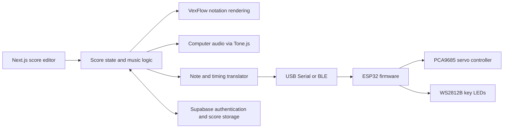

# Auto-Piano

Auto-Piano is a software and hardware project that turns digital sheet music into a physical piano performance. It brings together a browser-based score editor, music playback, wireless or wired communication, and an ESP32-powered instrument prototype.

Create a score in the editor or import a MusicXML file, preview it through your computer, then connect compatible hardware to schedule the notes on the instrument. The firmware coordinates servo movement and per-key LEDs to make the performance visible as well as audible.

## Features and workflow

1. **Create or import music.** Enter notes in the editor or import a MusicXML score. VexFlow renders the notation, while the editor supports musical settings such as clef, voice, tempo, key signature, time signature, note duration, and articulation.
2. **Edit and preview.** The score can be edited in the browser and previewed using local audio powered by Tone.js. This playback does not require the physical piano.
3. **Translate notes for the instrument.** The application converts pitches and durations into timed hardware events, maps pitches to LED/key indices, and applies tempo and dynamic markings to the event data.
4. **Play on the hardware.** Connect over USB Serial or Bluetooth Low Energy (BLE). The application sends the events to the ESP32, which queues them and starts playback when commanded. During playback, the firmware lights the corresponding WS2812B LEDs and actuates servo channels through a PCA9685 PWM driver.
5. **Save scores.** Users can sign in to save and retrieve scores through Supabase, or open the editor in guest mode.

Computer audio playback and hardware playback are separate paths: the first uses the browser's audio output; the second requires a compatible browser connection and the ESP32 hardware.

## System architecture



The frontend is organized around `ScoreEditor`. UI components handle score input and display, while custom hooks separate authentication, score state, editing, audio playback, and hardware connections. Shared music utilities keep the score representation consistent across editing, rendering, audio, and hardware translation. On the ESP32, incoming note commands are stored and then processed against a playback clock.

## Technology stack

- **Web application:** Next.js, React, TypeScript, and Tailwind CSS.
- **Notation and import:** VexFlow and a custom MusicXML parser.
- **Computer audio:** Tone.js.
- **Authentication and persistence:** Supabase.
- **Hardware communication:** Web Serial API and Web Bluetooth.
- **Firmware:** ESP32 using the Arduino framework and PlatformIO, with FastLED and the Adafruit PCA9685 servo driver.
- **Desktop packaging configuration:** Tauri 2.

## Roadmap and areas for improvement

The following items describe possible next steps; they are not all implemented in the current version.

- **Build a dedicated backend.** Move score and account operations behind a documented API instead of having the web client access Supabase directly. Add server-side validation and authorization, and keep persistence behind a service boundary so it can evolve independently from the UI.
- **Refine the interface.** Improve responsive behavior and accessibility, streamline score-editing workflows, and provide clearer connection, loading, and playback states for both computer audio and the physical instrument.
- **Add more languages.** Introduce internationalization for the application UI, starting with Spanish and English, and make labels, validation messages, and help text use the same translation system.
- **Expand musical authoring and score support.** Improve end-to-end handling of chords, multiple voices, rests, ties, tuplets, repeats, dynamics, articulations, and pedal markings across editing, MusicXML import/export, rendering, and playback. Keep notation, audio, and hardware behavior consistent for each supported feature.
- **Extend ESP32 interpretation.** Evolve the communication protocol with acknowledgements, validation, and recovery from interrupted transfers. Improve event scheduling for simultaneous notes and expressive features, and make actuator-to-key mapping configurable. The current firmware defines 88 LED positions and 12 servo channels; expanding physical key actuation requires matching hardware and a verified mapping.
- **Add automated tests.** Cover MusicXML parsing, note-to-hardware translation, communication edge cases, and firmware playback scenarios so changes can be checked across the application and device.

## Repository structure

```text
auto-piano/
├── web/                           # Next.js application and Tauri configuration
│   ├── app/                       # App Router entry point and global styles
│   ├── components/                # Editor, controls, and score rendering
│   ├── hooks/                     # Authentication, score, audio, and hardware state
│   └── utils/                     # Music logic, transports, and hardware translation
├── firmware/
│   └── piano_firmware/            # ESP32 firmware project managed by PlatformIO
└── README.md
```

## Getting started

### Web application

Requirements: Node.js and npm.

```bash
cd web
npm ci
```

Create `web/.env.local` with the credentials for your Supabase project:

```env
NEXT_PUBLIC_SUPABASE_URL=your_supabase_project_url
NEXT_PUBLIC_SUPABASE_ANON_KEY=your_supabase_anon_key
```

These client-side Supabase credentials are used for authentication and score storage. Keep `web/.env.local` local; it is excluded from Git.

Start the development server:

```bash
npm run dev
```

Open [http://localhost:3000](http://localhost:3000) in your browser. USB Serial and Bluetooth availability depends on browser and operating-system support.

### ESP32 firmware

Open `firmware/piano_firmware` in VS Code with PlatformIO, or install the PlatformIO CLI and run:

```bash
cd firmware/piano_firmware
pio run            # Build the firmware
pio run -t upload  # Flash the connected ESP32
```

## Demo and screenshots

Demo video, deployed application, and screenshots are not linked yet.
