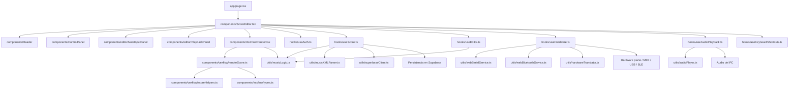
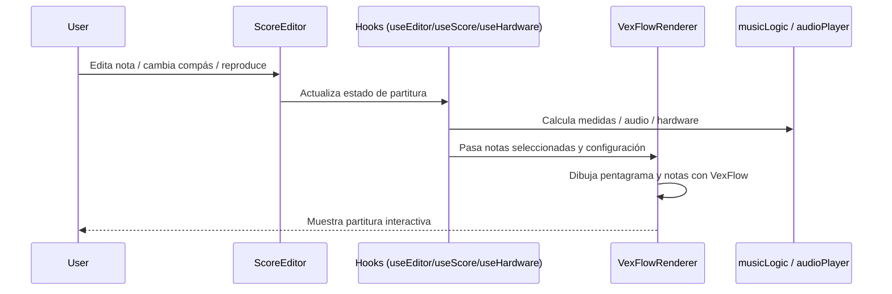

# Diagrama de arquitectura actual

## Vista general del flujo

## Flujo principal de interacción

## Resumen del proyecto

- La app está organizada como una interfaz principal de Next.js que monta el editor de partituras.
- El componente central es ScoreEditor, que coordina varios hooks.
- El render visual se hace con VexFlow a través de VexFlowRender y sus módulos auxiliares.
- La lógica musical y los servicios de audio/hardware se separan en utilidades.
- La persistencia y autenticación están apoyadas por Supabase.
